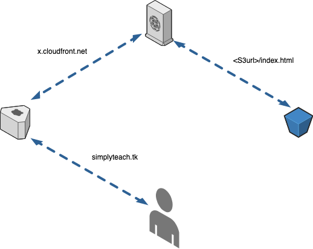

HLD
===

Certificate
===========

Input
-----
Input parameters for the module.

| Input                | Description                                   | Defaults  
| ---------------------|---------------------------------------------|---------
| aws_region           |The region in which certificate should be created    |   us-east-1
| domain_name          | Name of the domain                                  | simplyteach.tk   
| alternative_names    | Alternative names for this domain                   | ["simplyteach.tk","www.simplyteach.tk"]     
| existing             | Is the hosted zone avaialbe already?                | false      

Output
------
Output generated by this module.

| Output                | Description                                   
| ---------------------|---------------------------------------------
| certificate_arn      | ARN of the generated certificate

Website
===========

Input
-----
Input parameters for the module.

| Input                | Description                                   | Defaults  
| ---------------------|---------------------------------------------|---------
| aws_region            |The region to which the bucket belongs    |   ap-southeast-2
| domain_name           | Name of the domain                       | simplyteach.tk   
| alternative_names     | Alternative names for this domain        | ["simplyteach.tk","www.simplyteach.tk"]     
| build_repository_name | The name of the build repository         | juliuscanute/hugo-builder      
| aws_bucket_name       | The name of the S3 bucket                | hello-world-hugo-bucket

Live website can be found here: https://www.simplyteach.tk